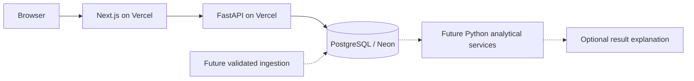

# Architecture

## Phase 1: implemented scope
Next.js renders the public research workspace. Its server route proxies the read-only FastAPI system endpoint. FastAPI accesses PostgreSQL through parameterized psycopg queries. Dataset counts are live database counts, not sample fixture values. The schema prepares later analytical modules; those modules are not yet implemented.

## Repository
- frontend/app: App Router shell and server-side API proxy
- frontend/components: responsive scientific workspace and shadcn-derived controls
- backend/app: FastAPI API and database access
- backend/migrations: immutable SQL migrations
- backend/scripts: checksummed migration runner
- backend/tests: health, validation and PostgreSQL constraint tests
- data/raw, processed, external, fixtures: future ingestion boundaries
- data_quality: validation policy
- docs: phased roadmap

## Database design
Genes use stable external numeric identifiers; symbols are searchable labels. Locations are separate and assembly-specific. A variant's unique key is assembly, chromosome, 1-based position, reference and alternate allele. Variants can overlap multiple genes.

Samples belong to studies and diseases. Molecular profiles record assay context; profile_samples includes unmutated samples and forms the future mutation-frequency denominator. profile_genes is available to specify targeted assay coverage. Importers must validate study/profile consistency and gene-level coverage. A missing observation is never automatically a confirmed negative result.

sample_variants carries sample-specific VAF, quality and source version. Population allele frequency and clinical interpretation are separately versioned annotations. VAF is not a population frequency.

Drug-target and drug-disease associations retain dataset versions and evidence. Drug response units, assay type and replicates remain explicit; no cross-assay comparison is implied.

Dataset versions have source, retrieval time, SHA-256 and fixture status. Ingestion reports reconcile downloaded = valid + invalid + duplicate records on successful runs. Analyses retain method version, parameters, results, source versions, random seed and code revision.

## Migration safety
The runner uses a PostgreSQL advisory transaction lock and one atomic transaction. Applied SQL is checksummed. Re-running is a no-op; modifying an applied migration raises an error. Add a new numbered migration for future changes. Migrations never execute during normal HTTP requests.

## Deployment
Two Vercel projects share one GitHub monorepo: pharmagenome (root frontend) and pharmagenome-api (root backend). Neon PostgreSQL connects only to the API. API_BASE_URL is server-only; the browser never receives DATABASE_URL.

FastAPI is supported by Vercel's Python runtime: https://vercel.com/docs/frameworks/backend/fastapi . Docker Compose supplies a separate PostgreSQL 17 environment for reproducible development. Redis/background workers are deferred until workload evidence requires them.

## Security and limitations
Read-only public routes; bounded pagination and symbol input; SQL parameters; request IDs without secret logging; bounded database and HTTP timeouts; restrictive CORS. Public read access is limited to scientific catalog/system metadata. No uploads, PHI, patient identifiers or arbitrary execution are exposed.
The platform is educational/research software. Phase 1 has no clinical claims, analytical calculations, AI explanations or model training.
