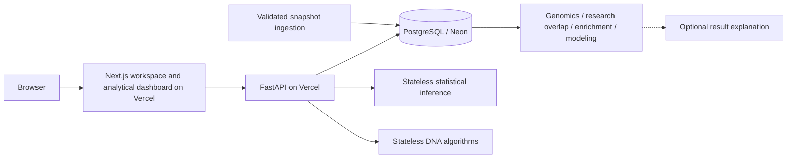

# Architecture

## Phase 10: implemented scope
Next.js renders the public research workspace. Its server route proxies the read-only FastAPI system and dataset-report endpoints. FastAPI accesses PostgreSQL through parameterized psycopg queries. Dataset counts are live database counts, not sample fixture values. Descriptive genomic exploration and stateless sequence algorithms are implemented; drug-target/pathway associations, bounded statistical inference and CellMiner cell-line response modeling are implemented.

## Repository
- frontend/app: App Router shell and server-side API proxy
- frontend/components: responsive scientific workspace and shadcn-derived controls
- backend/app: FastAPI API and database access
- backend/migrations: immutable SQL migrations
- backend/scripts: checksummed migration runner, official-source capture/replay and transactional importer
- backend/tests: health, validation and PostgreSQL constraint tests
- data/raw, processed, external, fixtures: future ingestion boundaries
- data_quality: validation policy
- docs: phased roadmap

## Database design
Genes use stable external numeric identifiers; symbols are searchable labels. Locations are separate and assembly-specific. A variant's unique key is assembly, chromosome, 1-based position, reference and alternate allele. Variants can overlap multiple genes.

Samples belong to studies and diseases. Molecular profiles record assay context; profile_samples includes unmutated samples and forms the future mutation-frequency denominator. profile_genes is available to specify targeted assay coverage. Importers must validate study/profile consistency and gene-level coverage. A missing observation is never automatically a confirmed negative result.

sample_variants carries sample-specific VAF, quality and source version. Population allele frequency and clinical interpretation are separately versioned annotations. VAF is not a population frequency.

Drug-target and drug-disease associations retain dataset versions and evidence. Drug response units, assay type and replicates remain explicit; no cross-assay comparison is implied.

Dataset versions have source, retrieval time, SHA-256 and fixture status. Ingestion reports reconcile downloaded = valid + invalid + excluded + duplicate records on successful runs. Analyses retain method version, parameters, results, source versions, random seed and code revision.

## Migration safety
The runner uses a PostgreSQL advisory transaction lock and one atomic transaction. Applied SQL is checksummed. Re-running is a no-op; modifying an applied migration raises an error. Add a new numbered migration for future changes. Migrations never execute during normal HTTP requests.

## Deployment
Two Vercel projects share one GitHub monorepo: pharmagenome (root frontend) and pharmagenome-api (root backend). Neon PostgreSQL connects only to the API. API_BASE_URL is server-only; the browser never receives DATABASE_URL.

FastAPI is supported by Vercel's Python runtime: https://vercel.com/docs/frameworks/backend/fastapi . Docker Compose supplies a separate PostgreSQL 17 environment for reproducible development. Redis/background workers are deferred until workload evidence requires them.

## Security and limitations
Read-only catalogue routes; bounded stateless sequence/statistics POST routes; an allowlisted drug-response evaluation POST; and an evidence-schema-validated explanation POST that is unavailable without server-side credentials. Pagination, symbols, bodies and timeouts are bounded; SQL uses parameters; request IDs omit secrets; CORS is restrictive. Public read access is limited to scientific catalog/system metadata. Sequence text uploads are bounded and not persisted to the application database. No clinical-data storage or arbitrary execution is exposed.
The platform is educational/research software. Model evaluation is restricted to internal NCI-60 cell-line validation; no clinical validity or AI explanation is claimed.

The initial Vercel API build applies idempotent migrations in its trusted build environment. Subsequent schema releases should move migration execution to a controlled release job before traffic switches; do not use destructive migrations in preview builds.

## Snapshot ingestion
The committed cBioPortal LUAD snapshot retains all 566 profiled samples and a declared ten-gene SNV subset. Ensembl GRCh37 metadata supplies bounds. Capture preserves raw response bytes; replay validates the complete manifest and source IDs before Pydantic row validation, coordinate normalization and observation deduplication.

A transaction-scoped advisory lock serializes imports. Validation failures stop before writes; database failures roll back all writes. Successful import reports are stored with the same transaction. Rejected captures retain report evidence in the Actions artifact, not a partly populated production dataset.

Dataset SHA identifies an immutable import. Molecular profiles include the SHA so later imports retain their own sample observations. dataset_genes records source symbols/types and study_dataset_versions records each study/source-version relationship. Global variant identity remains assembly/locus/alleles; counts of global unique variants differ from versioned sample observations. Production blocks synthetic fixtures. No network capture, migration or mutation runs through public HTTP endpoints.

GET /api/datasets/{id}/report returns the source manifest, quality counts, rejection reasons and pipeline metadata. The frontend proxies fixed backend paths with bounded timeouts and displays download failures with retry. Database credentials remain server-only.

## Phase 3 genomic exploration
GET /api/genomics reads one completed snapshot and computes bounded descriptive results. The core separates eligible profiled samples from matching variant observations, preserves gene-specific denominators, deduplicates sample identities and returns explicit nulls for undefined frequencies. New dataset_variant_genes associations prevent future source versions from borrowing earlier consequences. The frontend uses Recharts charts adapted from shadcn registry examples, semantic tables and native filter controls. See [methods and API](docs/GENOMICS.md).

## Phase 4 sequence computation
POST /api/sequences/statistics and /api/sequences/align normalize and validate DNA, then compute without PostgreSQL. The frontend streams and bounds JSON request bodies before forwarding to fixed API paths. Inputs and scoring changes invalidate displayed results. Exports include normalized inputs, hashes, methods, parameters and code revision. See [sequence methods](docs/SEQUENCES.md).

## Phase 5 research associations
Migration 004 adds snapshot-scoped target identity, drug/pathway metadata, memberships, mechanisms, research disease labels and source report rows. Existing global identifiers remain stable; analysis queries use the versioned tables. A second pinned importer validates official Ensembl/Open Targets captures, then writes atomically under an advisory lock. GET /api/research computes distinct drugs, deduplicated report counts and independent pathway overlap. Public requests never mutate imported data. See [methods](docs/RESEARCH.md).

## Phase 6 statistical analysis

POST /api/statistics/measurements validates finite numerical groups and applies the declared test without missing-value deletion or imputation. POST /api/statistics/contingency validates integer 2 × 2 tables and guards sparse chi-square inference. These requests are not written to PostgreSQL. Responses include descriptive distributions, explicit hypotheses and assumptions, effect estimates, available intervals, input hashes, method/software versions and code revision.

GET /api/statistics/options returns the minimal source universe for one research snapshot. POST /api/statistics/enrichment reads immutable snapshot-scoped gene/pathway membership, tests every pathway with a one-sided hypergeometric upper tail, and applies BH and primary BY adjustment to the entire family before sorting. The ten-gene source universe is displayed and exported; results are conditional rather than genome-wide. See [statistical methods](docs/STATISTICS.md).

## Phase 7 drug-response modeling

Migration 005 adds snapshot-scoped cell-line features while reusing the original drug-response table. The CellMiner importer creates one versioned NCI-60 dataset, links all cell lines through a dedicated study, records expression and mutation features with explicit units, and stores each available drug activity z score. Missing source values create no measurement row. Production rejects fixtures, identical checksums are no-ops, and the import commits atomically under its own advisory lock.

`GET /api/modeling/options` declares the source snapshot, drugs, eligible mutation groups, allowed predictors and fixed validation protocol. `GET /api/modeling/response` computes an exploratory mutation-stratified response comparison. `POST /api/modeling/evaluate` uses a predeclared activity z-score boundary of zero, then trains only inside repeated stratified folds. The target boundary is independent of held-out outcomes. Imputation and scaling live inside the scikit-learn pipeline, preventing test-fold distribution information from fitting preprocessing. Response fields are outside the predictor allowlist.

The three fixed estimators share identical splits and are compared with a prior-probability dummy classifier. API results include fold summaries, every held-out prediction, pooled ROC coordinates, confusion counts, permutation importance, data/code hashes and explicit interpretation limits. The frontend proxy enforces fixed paths, query allowlists, bounded request size and timeouts. See [modeling methods](docs/MODELING.md).

## Phase 8 evidence-constrained explanation

`GET /api/research/explain/status` reports only whether server-side model access is configured; it never reveals credentials. `POST /api/research/explain` is separate from every analytical endpoint. Statistics and drug-response modeling compute first, then the browser sends a compact result envelope that excludes raw measurement groups, tables, cell-line points, ROC coordinates and individual predictions.

The API validates JSON size, depth, field counts, finite numbers and machine-readable evidence keys. GPT-6 Astra receives inert evidence rows through the OpenAI Responses API with `store: false`, low reasoning effort and a strict JSON schema. Every generated statement must cite submitted evidence IDs. A post-generation verifier rejects unknown citations and any numeric token absent from the canonical evidence document. The returned envelope includes the model, provider, response ID, generation time and evidence SHA-256.

`OPENAI_API_KEY` exists only in the backend runtime. Missing credentials produce an explicit unavailable state while computed results, provenance and exports remain fully functional. The deployment has not produced or claimed a live model explanation because the production key is not configured. See [explanation contract](docs/AI_EXPLANATIONS.md).

## Phase 9 analytical dashboard

The dashboard composes existing API results rather than adding a second analytical path. It requests bounded genomic rankings and distributions from `GET /api/genomics`, plus source-ranked drugs and pathway context from `GET /api/research`. The interface labels the VAF histogram as a cohort pattern and keeps the profiled-sample denominator beside gene frequencies. Drug-target links remain research associations, not efficacy or response claims.

Successful statistical and model runs write only a small navigation record to browser local storage: analysis kind, display title, short result summary, source name and timestamp. Raw groups, contingency tables, gene selections, cell-line points and prediction records are never stored in recent history. The server does not receive this history. Storage writes are best-effort and cannot change a successful analytical result into an error.

The navigation keeps separate purpose labels for Drugs and Pathways, and for Drug Response and ML Analysis, while reusing their common evidence workspaces. The Research Assistant overview exposes the existing compute-first explanation boundary. At viewport widths through 760 px the fixed rail becomes an inert, focus-trapped drawer; the application page remains horizontally contained.

## Phase 10 reproducible release

`examples/reproduce.py` uses only the Python standard library and the public FastAPI contract. It writes complete, reviewable JSON for system provenance, genomic distributions, sequence statistics, global alignment, a Welch test and a fixed drug-response evaluation. A manifest records the API version, phase, result filenames, source/input hashes and explicit interpretation boundaries. The script does not call the optional explanation endpoint, so reproduction does not require an OpenAI API key.

CI lint-checks and compiles the reproducer alongside the application. The release gate remains the full PostgreSQL test suite, production frontend build, browser suite and anonymous deployment verification.
