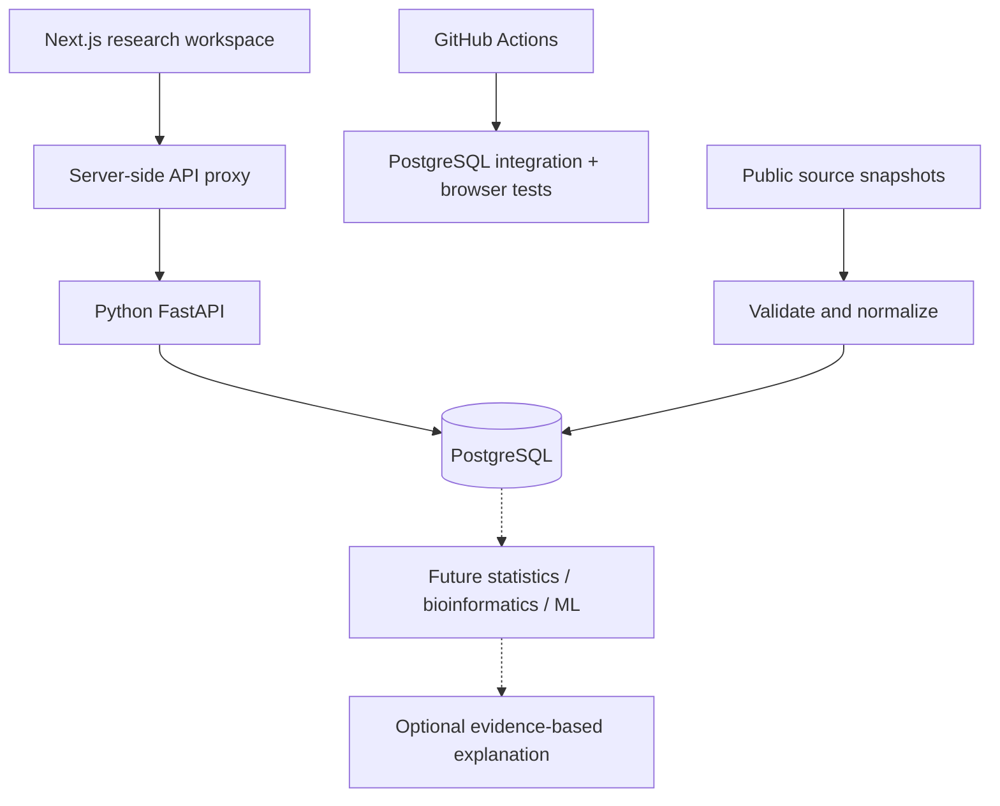

# PharmaGenome
### Genomic & Pharmaceutical Data Analytics Platform

An analytical and research platform for exploring relationships between genomic variation and pharmaceutical data.

**Current delivery: Phase 3 genomic exploration.** A live PostgreSQL-backed workspace with a versioned public TCGA LUAD snapshot, validated SNV observations, provenance and downloadable quality reports. Genomic explorers and descriptive charts are implemented; sequence tools, inferential statistics, drugs and ML remain subsequent phases.

## Why this project exists
To demonstrate data engineering, bioinformatics and statistical reasoning through reproducible computation. The planned LLM feature explains computed results; it never substitutes for analysis.

## Architecture


## What works through Phase 3
- Normalized source, cohort, variant, gene, drug, pathway and analysis-record schema.
- Checksummed, atomic and idempotent migrations.
- Live API liveness/readiness and database inventory.
- Parameterized gene lookup, bounded filtering and pagination.
- A real 566-sample, ten-gene TCGA LUAD import: 839 accepted observations and 506 unique SNVs.
- Checksummed capture/replay, strict validation, scope exclusions, deduplication and atomic versioned import.
- Source catalogue, scope limitations, quality report download, dark/light mode and JSON system snapshot.
- Gene/variant search, cohort filters, deterministic sorting and pagination.
- Gene mutation frequencies with profiled denominators; interactive charts, VAF histogram, mutation matrix and reproducible JSON exports.
- Honest empty, loading, unavailable and connected states.
- PostgreSQL constraint tests and browser interaction tests.

## Stack
Next.js 16, React 19, TypeScript, Tailwind CSS 4, shadcn-derived controls; FastAPI, psycopg, PostgreSQL 17; Docker Compose; GitHub Actions; Vercel and Neon.

## Scientific methods
Implemented mutation frequencies use distinct matching samples divided by eligible profiled samples; see [genomic methods](docs/GENOMICS.md). Planned alignments implement Needleman-Wunsch and Smith-Waterman directly. Planned enrichment uses a documented gene universe, hypergeometric/Fisher tests and Benjamini-Hochberg adjustment. Planned statistics report assumptions, hypotheses, sample counts, effect sizes and limitations. Sequence algorithms and inferential methods remain planned.

## ML and AI
Training is gated on valid public response data, patient/study-aware splits, cross-validation and multiple evaluation metrics. Optional explanations require server-side API credentials and a model confirmed accessible to that API account. No LLM, model metrics, clinical predictions or API-key fields are faked in Phase 2.

## Quick start: Docker
Requires Docker with Compose.
```sh
cp .env.example .env
# Set a private development POSTGRES_PASSWORD in .env.
docker compose up --build
```
Frontend: http://localhost:3000 . API docs: http://localhost:8000/docs .
Compose starts PostgreSQL, applies migrations and imports the pinned public snapshot, then starts the API and frontend. Database ports bind to loopback only.

## Run services individually
Requires Python 3.12+, Node 22+ and PostgreSQL 17.
```sh
docker compose up -d db
cd backend
python -m venv .venv
# Activate .venv for your shell.
pip install -r requirements-dev.txt
# Set DATABASE_URL in your environment (see .env.example).
python -m scripts.migrate
python -m scripts.load_snapshot
uvicorn app.main:app --reload
```
In another terminal:
```sh
cd frontend
npm install
# Set API_BASE_URL=http://localhost:8000 in frontend/.env.local.
npm run dev
```
PowerShell environment syntax: `$env:API_BASE_URL='http://localhost:8000'`. For DATABASE_URL use your secret manager or private environment, never a committed file.

## Environment variables
| Variable | Service | Required | Purpose |
|---|---|---|---|
| DATABASE_URL | Backend / migration | Yes for database access | PostgreSQL URI; TLS in production |
| ALLOWED_ORIGINS | Backend | Recommended | Comma-separated permitted web origins |
| API_BASE_URL | Frontend server | Yes | Backend URL; not NEXT_PUBLIC |
| POSTGRES_PASSWORD | Docker only | Yes | Development database password |

No OpenAI API key is required or consumed in Phase 2.

## Tests
```sh
cd backend
ruff check app scripts tests
python -m scripts.migrate
pytest -q
cd ../frontend
npm install
npm run typecheck
npm run build
npx playwright install chromium
npm test
```
Database tests skip without DATABASE_URL; CI always provisions PostgreSQL and must execute them. Frontend tests use clearly scoped mocked API states for deterministic component interactions. Live endpoint/browser verification is separate.

## Ingestion
Run from backend with DATABASE_URL configured:
```sh
python -m scripts.migrate
python -m scripts.load_snapshot
# Reproduce normalization from committed raw bytes:
python -m scripts.capture_snapshot --replay --output data/luad_snv
# Capture a new snapshot into a NEW directory; inspect before promotion:
python -m scripts.capture_snapshot --output capture/new-snapshot
```
The GitHub Actions **Capture public scientific snapshot** workflow also captures raw bytes and a quality report as an artifact. A successful capture is reviewed and committed before deployment; production never fetches an unpinned live dataset at startup. Re-importing the same checksum is a no-op. A different snapshot retains its own molecular profile and observations. See [data sources](DATA_SOURCES.md) for counts, licensing and scientific limits.

## Reproducibility example
Open **Data sources → Download quality report** for the full import report, rejected-row reasons, source manifest and checksum. Click **Export system snapshot** to export the actual database connection state, counts, source catalogue and timestamp. This is infrastructure evidence, not a scientific analysis. Future analysis exports must include method, filters, code revision, dataset checksums, results, limitations and sources.

## Deployment
Create two Vercel projects from this repository:
1. `pharmagenome-api`, root `backend`, FastAPI framework.
2. `pharmagenome`, root `frontend`, Next.js framework.
Connect Neon PostgreSQL to the API project only. The backend build applies migrations and the pinned, idempotent snapshot import using its private DATABASE_URL. Set the frontend API_BASE_URL to the backend production URL. Set ALLOWED_ORIGINS to the frontend origin. Deploy and verify /api/health, /api/ready, /api/system, then desktop and mobile pages.

See [ARCHITECTURE.md](ARCHITECTURE.md), [DATA_SOURCES.md](DATA_SOURCES.md) and [roadmap](docs/ROADMAP.md).

## Screenshots
GitHub Actions publishes desktop/mobile browser captures in its browser-evidence artifact. These deterministic screenshots verify empty, unavailable and explicitly synthetic populated states; they do not constitute evidence for scientific counts. See [verification evidence](docs/VERIFICATION.md).

## Live Phase 3 release
- Workspace: https://pharmagenome.vercel.app
- API documentation: https://pharmagenome-api.vercel.app/docs
- Database: Neon PostgreSQL, migrations through 003_genomics applied; public TCGA LUAD subset imported.

## Limitations
Phase 3 covers ten selected genes and unambiguous GRCh37 SNVs only. It contains no inferential statistical tests, sequence algorithms, drug-response dataset, ML or AI explanation layer. The schema alone does not validate biological annotations. No clinical validity is claimed.

## Scientific disclaimer
This platform is intended for educational, research, and analytical purposes. Results are not medical advice and should not be used to diagnose disease or make treatment decisions.
