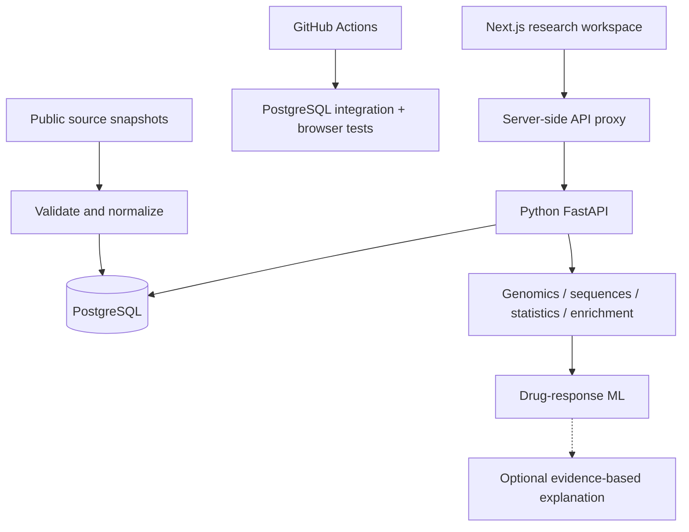

# PharmaGenome
### Genomic & Pharmaceutical Data Analytics Platform

An analytical and research platform for exploring relationships between genomic variation and pharmaceutical data.

**Current delivery: Phase 7 drug-response modeling.** A live PostgreSQL-backed workspace with a versioned public TCGA LUAD snapshot, validated SNV observations, provenance and downloadable quality reports. Genomic explorers, descriptive charts, DNA statistics and global/local alignment are implemented; drug-target links and pathway overlaps add source-linked pharmaceutical context; hypothesis tests, correlations and restricted-universe pathway enrichment add transparent statistical inference; a pinned CellMiner NCI-60 panel now supports cell-line response comparisons and leakage-aware model evaluation.

## Why this project exists
To demonstrate data engineering, bioinformatics and statistical reasoning through reproducible computation. The planned LLM feature explains computed results; it never substitutes for analysis.

## Architecture


## What works through Phase 7
- Normalized source, cohort, variant, gene, drug, pathway and analysis-record schema.
- Checksummed, atomic and idempotent migrations.
- Live API liveness/readiness and database inventory.
- Parameterized gene lookup, bounded filtering and pagination.
- A real 566-sample, ten-gene TCGA LUAD import: 839 accepted observations and 506 unique SNVs.
- Checksummed capture/replay, strict validation, scope exclusions, deduplication and atomic versioned import.
- Source catalogue, scope limitations, quality report download, dark/light mode and JSON system snapshot.
- Gene/variant search, cohort filters, deterministic sorting and pagination.
- Gene mutation frequencies with profiled denominators; interactive charts, VAF histogram, mutation matrix and reproducible JSON exports.
- DNA composition, overlapping k-mers, single-record FASTA input, global/local alignment, score-matrix preview and reproducible JSON exports.
- 183 source-linked drugs, 186 gene-drug associations and 220 pathways from a pinned Open Targets snapshot.
- Drug filtering, source evidence details, focused association network, pathway overlap ranking and paginated JSON exports.
- Welch, Mann–Whitney, Pearson, Spearman, one-way ANOVA, Kruskal–Wallis, Fisher exact and chi-square tests with explicit hypotheses and assumptions.
- Exact empirical distributions, effect sizes, available confidence intervals, complete input hashes and reproducible JSON exports.
- Hypergeometric over-representation across all 220 imported pathways, with BH and primary BY false-discovery adjustment in the declared ten-gene universe.
- CellMiner NCI-60 response comparisons for ten predeclared FDA-status drugs and the established ten-gene panel.
- Logistic regression, random forest and histogram gradient boosting with fixed hyperparameters, 5-fold × 3-repeat stratified validation and a prior baseline.
- Accuracy, balanced accuracy, precision, recall, F1, ROC-AUC, pooled ROC/confusion matrix, held-out permutation importance and complete prediction exports.
- Honest empty, loading, unavailable and connected states.
- PostgreSQL constraint tests and browser interaction tests.

## Stack
Next.js 16, React 19, TypeScript, Tailwind CSS 4, shadcn-derived controls; FastAPI, psycopg, PostgreSQL 17; Docker Compose; GitHub Actions; Vercel and Neon.

## Scientific methods
Implemented mutation frequencies use distinct matching samples divided by eligible profiled samples; see [genomic methods](docs/GENOMICS.md). Implemented alignments use Needleman-Wunsch and Smith-Waterman directly; see [sequence methods](docs/SEQUENCES.md). Statistical methods include explicit hypotheses, assumptions, sample counts, effects and conditional source-scoped enrichment; see [statistical methods](docs/STATISTICS.md). Drug-response target construction, leakage controls and evaluation are specified in [modeling methods](docs/MODELING.md).

## ML and AI
The implemented ML module uses aligned NCI-60 cell lines, training-fold preprocessing, repeated stratified cross-validation, a prior baseline and multiple metrics. It is internal cell-line validation, not patient/study or external validation. Optional explanations require server-side API credentials and a model confirmed accessible to that API account. No LLM, clinical prediction or API-key field is faked.

## Quick start: Docker
Requires Docker with Compose.
```sh
cp .env.example .env
# Set a private development POSTGRES_PASSWORD in .env.
docker compose up --build
```
Frontend: http://localhost:3000 . API docs: http://localhost:8000/docs .
Compose starts PostgreSQL, applies migrations and imports the pinned public snapshot, then starts the API and frontend. Database ports bind to loopback only.

## Run services individually
Requires Python 3.12+, Node 22+ and PostgreSQL 17.
```sh
docker compose up -d db
cd backend
python -m venv .venv
# Activate .venv for your shell.
pip install -r requirements-dev.txt
# Set DATABASE_URL in your environment (see .env.example).
python -m scripts.migrate
python -m scripts.load_snapshot
python -m scripts.load_associations
python -m scripts.load_modeling
uvicorn app.main:app --reload
```
In another terminal:
```sh
cd frontend
npm install
# Set API_BASE_URL=http://localhost:8000 in frontend/.env.local.
npm run dev
```
PowerShell environment syntax: `$env:API_BASE_URL='http://localhost:8000'`. For DATABASE_URL use your secret manager or private environment, never a committed file.

## Environment variables
| Variable | Service | Required | Purpose |
|---|---|---|---|
| DATABASE_URL | Backend / migration | Yes for database access | PostgreSQL URI; TLS in production |
| ALLOWED_ORIGINS | Backend | Recommended | Comma-separated permitted web origins |
| API_BASE_URL | Frontend server | Yes | Backend URL; not NEXT_PUBLIC |
| POSTGRES_PASSWORD | Docker only | Yes | Development database password |

No OpenAI API key is required or consumed through Phase 7.

## Tests
```sh
cd backend
ruff check app scripts tests
python -m scripts.migrate
pytest -q
cd ../frontend
npm install
npm run typecheck
npm run build
npx playwright install chromium
npm test
```
Database tests skip without DATABASE_URL; CI always provisions PostgreSQL and must execute them. Frontend tests use clearly scoped mocked API states for deterministic component interactions. Live endpoint/browser verification is separate.

## Ingestion
Run from backend with DATABASE_URL configured:
```sh
python -m scripts.migrate
python -m scripts.load_snapshot
# Reproduce normalization from committed raw bytes:
python -m scripts.capture_snapshot --replay --output data/luad_snv
# Capture a new snapshot into a NEW directory; inspect before promotion:
python -m scripts.capture_snapshot --output capture/new-snapshot
```
The GitHub Actions **Capture public scientific snapshot** workflow also captures raw bytes and a quality report as an artifact. A successful capture is reviewed and committed before deployment; production never fetches an unpinned live dataset at startup. Re-importing the same checksum is a no-op. A different snapshot retains its own molecular profile and observations. See [data sources](DATA_SOURCES.md) for counts, licensing and scientific limits.

## Reproducibility example
Open **Data sources → Download quality report** for the full import report, rejected-row reasons, source manifest and checksum. Click **Export system snapshot** to export the actual database connection state, counts, source catalogue and timestamp. This is infrastructure evidence, not a scientific analysis. Analysis exports include method, filters, code revision, dataset checksums, results, limitations and sources.

## Deployment
Create two Vercel projects from this repository:
1. `pharmagenome-api`, root `backend`, FastAPI framework.
2. `pharmagenome`, root `frontend`, Next.js framework.
Connect Neon PostgreSQL to the API project only. The backend build applies migrations and the pinned, idempotent snapshot import using its private DATABASE_URL. Set the frontend API_BASE_URL to the backend production URL. Set ALLOWED_ORIGINS to the frontend origin. Deploy and verify /api/health, /api/ready, /api/system, then desktop and mobile pages.

See [ARCHITECTURE.md](ARCHITECTURE.md), [DATA_SOURCES.md](DATA_SOURCES.md) and [roadmap](docs/ROADMAP.md).

## Screenshots
GitHub Actions publishes desktop/mobile browser captures in its browser-evidence artifact. These deterministic screenshots verify empty, unavailable and explicitly synthetic populated states; they do not constitute evidence for scientific counts. See [verification evidence](docs/VERIFICATION.md).

## Live Phase 7 release
- Workspace: https://pharmagenome.vercel.app
- API documentation: https://pharmagenome-api.vercel.app/docs
- Database: Neon PostgreSQL, migrations through 005_drug_response_modeling applied; TCGA LUAD, Open Targets and CellMiner snapshots imported.

## Limitations
Genomic exploration covers ten selected genes and unambiguous GRCh37 SNVs only. Sequence tools operate on user-supplied DNA with documented size and scoring limits. The enrichment universe is a deliberately selected ten-gene import, so results are conditional and not genome-wide. The CellMiner module is cell-line-only internal validation. This release contains no clinical prediction or AI explanation layer. The schema alone does not validate biological annotations. No clinical validity is claimed.

## Scientific disclaimer
This platform is intended for educational, research, and analytical purposes. Results are not medical advice and should not be used to diagnose disease or make treatment decisions.

Phase 7 methods: [drug-response modeling](docs/MODELING.md). Phase 6 evidence and boundaries: [statistical methods](docs/STATISTICS.md). Phase 5 association methods remain in [research methods](docs/RESEARCH.md). Open Targets' AACT trial labels can include upstream LLM extraction; this app's filtering and overlap computations do not use an LLM. Clinical report counts are not independent study or efficacy counts.
